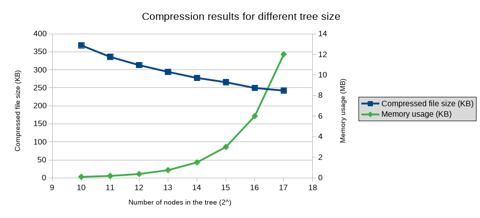

# lz78
A program implementing lz78 algorithm to compress and decompress text files.
The user can change the size of the tree, internally used to implement the algorithm, in order to obtain different trade-offs between compression performance and run time memory usage.

In the following image is shown the compression performance and the memory usage for different size of the tree. The input file is a 568 KB text file.

